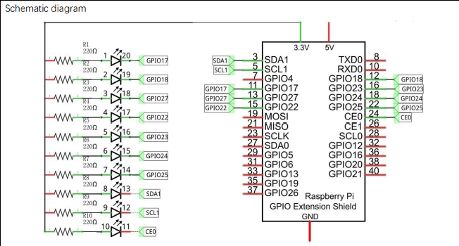

Small Project lighting up 10 LEDs attached to GPIO of raspberry PI 4

Wiring schematic:

Note that the schematic and the pins referenced in my code may differ. Ensure you select the correct pins!

Use at own risk